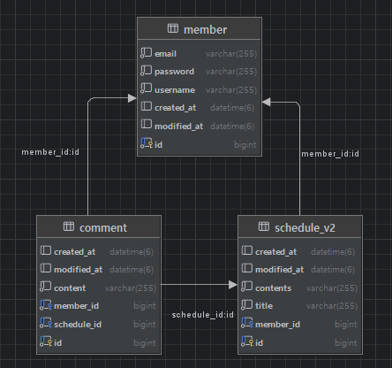

# schedule_api

## 프로젝트 개요

프로젝트명: 일정 관리 API 구현 Ver2.

본 API는 회원 가입을 기반으로 일정을 등록하고, 조회, 수정, 삭제할 수 있는 기능을 제공합니다.

## 트러블슈팅
- [모든 에러가 500에러? 원인은 DTO 였다..](https://ddokyun.tistory.com/55)
- [전체 일정 조회 시 N+1 문제 발생](https://ddokyun.tistory.com/53)

## Git 컨벤션
| 태그       | 설명                                       |
|------------|--------------------------------------------|
| `feat`     | 새로운 기능 추가                           |
| `fix`      | 버그 수정                                  |
| `refactor` | 코드 리팩토링 (기능 변화 없이 구조 개선)   |
| `docs`     | 문서 수정 (예: README, 주석 등)            |
| `chore`    | 기타 설정, 빌드, 패키지 등                 |

## 개발 환경

| 항목           | 내용                                        |
|----------------|-------------------------------------------|
| 언어           | Java 17 (JDK 17)                          |
| 프레임워크     | Spring Boot 3.4.5                         |
| 빌드 도구      | Gradle                                    |
| 데이터베이스   | MySQL 8.0.31                              |
| DB 접근 방식    | Spring Data JPA                           |
| 검증 라이브러리 | Spring Boot Starter Validation (`@Valid`) |
| IDE            | IntelliJ IDEA                             |
| API 테스트 도구 | Postman                                   |

## ERD


## API 명세서

## API 목록

- 회원
    - [회원가입](#회원가입)
    - [로그인](#로그인)
    - [로그아웃](#로그아웃)
    - [회원 단일 조회](#회원-단일-조회)
    - [회원 전체 조회](#회원-전체-조회)
    - [회원 수정](#회원-수정)
    - [회원 삭제](#회원-삭제)

- 일정
    - [일정 등록](#일정-등록)
    - [일정 전체 조회](#일정-전체-조회)
    - [일정 단일 조회](#일정-단일-조회)
    - [일정 수정](#일정-수정)
    - [일정 삭제](#일정-삭제)

- 댓글
    - [댓글 등록](#댓글-등록)
    - [댓글 조회](#댓글-조회)
    - [댓글 수정](#댓글-수정)
    - [댓글 삭제](#댓글-삭제)

- [공통 에러 응답 형식](#공통-에러-응답-형식)

---

### 회원가입

| 항목             | 내용                                |
|----------------|-------------------------------------|
| URL            | `/api/v2/members/signup`            |
| **Method**     | `POST`                              |
| **설명**         | 새로운 회원을 등록합니다.             |
| **인증 필요 여부** | 로그인 없이 접근 가능               |
| **요청 Content-Type** | `application/json`                |


#### Request Body

```json
{
  "username": "test1",
  "email": "test1@example.com",
  "password": "ehrbs0903."
}
```


| 필드명   | 타입    | 필수 여부 | 제약 조건                             |
|----------|---------|-------|-----------------------------------|
| username | String  | O     | 2~10자, 공백 불가                      |
| email    | String  | O     | 이메일 형식 준수 (`kimdk0903@naver.com`) |
| password | String  | O     | 8~16자, 영문+숫자+특수문자 1개 이상 포함 필요     |


#### Response Body (201 Created)

```json
{
  "id": 1,
  "username": "test1",
  "email": "test1@example.com",
  "modifiedAt": "2025-05-25T15:00:00"
}
```
| 필드명     | 타입            | 설명         |
|------------|---------------|------------|
| id         | Long          | 생성된 유저의 ID |
| username   | String        | 유저명        |
| email      | String        | 이메일 주소     |
| modifiedAt | LocalDataTime | 마지막 수정 일시  |

#### Error Responses

| 상황                            | 상태코드 | 에러 코드             | 메시지 예시                                     |
|---------------------------------|----------|------------------------|--------------------------------------------------|
| 유효성 검증 실패                | 400      | `VALIDATION_FAILED`    | `"username은 최소 2자 이상이어야 합니다."`       |
| 이메일 형식 오류                | 400      | `VALIDATION_FAILED`    | `"이메일 형식이 올바르지 않습니다."`             |
| 중복 이메일 (이미 존재할 경우) | 409      | `EMAIL_ALREADY_EXISTS` | `"이미 사용 중인 이메일입니다."`                 |

---

### 로그인

| 항목             | 내용                                |
|----------------|-------------------------------------|
| URL            | `/api/v2/members/login`            |
| **Method**     | `POST`                              |
| **설명**         | 이메일과 비밀번호를 통해 로그인합니다.             |
| **인증 필요 여부** | 로그인 없이 접근 가능               |
| **요청 Content-Type** | `application/json`                |


#### Request Body

```json
{
  "email": "test1@example.com",
  "password": "ehrbs0903."
}
```


| 필드명   | 타입    | 필수 여부 | 제약 조건                             |
|----------|---------|-------|-----------------------------------|
| email    | String  | O     | 이메일 형식 준수 (`kimdk0903@naver.com`) |
| password | String  | O     | 8~16자, 영문+숫자+특수문자 1개 이상 포함 필요     |


#### Response Body (200 OK)

```json
{
  "id": 1,
  "username": "test1",
  "email": "test1@example.com"
}
```
| 필드명     | 타입   | 설명         |
|------------|--------|------------|
| id         | Long   | 생성된 유저의 ID |
| username   | String | 유저명        |
| email      | String | 이메일 주소     |

#### Error Responses

| 상황                            | 상태코드 | 에러 코드             | 메시지 예시                                     |
|---------------------------------|----------|-----------------------|--------------------------------------------------|
| 존재하지 않는 이메일                | 401      | `EMAIL_NOT_FOUND`    | `"해당 이메일의 회원이 존재하지 않습니다."`       |
| 비밀번호 불일치                | 401      | `INVALID_PASSWORD`   | `"비밀번호가 일치하지 않습니다."`             |
| 유효성 검증 실패 (@Valid 오류) | 400      | `VALIDATION_FAILED` | `"이메일 형식이 올바르지 않습니다."`                 |

---

### 로그아웃

| 항목             | 내용                                |
|----------------|-------------------------------------|
| URL            | `/api/v2/members/logout`            |
| **Method**     | `POST`                              |
| **설명**         | 현재 로그인된 사용자의 세션을 만료시켜 로그아웃합니다.             |
| **인증 필요 여부** | 로그인된 사용자만 접근 가능               |
| **요청 Content-Type** | 없음 (Cookie로 인증)                |


#### Request Body

- 별도의 Request Body는 필요하지 않음


#### Response Body (204 NO_CONTENT)

- 없음

#### Error Responses

| 상황                            | 상태코드 | 에러 코드             | 메시지 예시                                     |
|---------------------------------|----------|------------------------|--------------------------------------------------|
| 로그인하지 않은 상태                | 401      | `UNAUTHORIZED`    | `"로그인이 필요합니다."`       |

---

### 회원 단일 조회

| 항목             | 내용                       |
|----------------|--------------------------|
| URL            | `/api/v2/members/{id}`   |
| **Method**     | `GET`                    |
| **설명**         | 고유 ID로 특정 회원의 정보를 조회합니다. |
| **인증 필요 여부** | 로그인 없이 접근 가능             |
| **요청 Content-Type** | 없음 (쿼리 파라미터 또는 경로 변수 사용) |


#### Path Variable

| 변수명      | 타입     | 설명         |
|----------|--------|------------|
| id       | Long   | 조회할 회원의 ID |


#### Response Body (200 OK)

```json
{
  "id": 1,
  "username": "test1",
  "email": "test1@example.com",
  "modifiedAt": "2025-05-25T15:00:00"
}
```
| 필드명     | 타입            | 설명         |
|------------|---------------|------------|
| id         | Long          | 생성된 유저의 ID |
| username   | String        | 유저명        |
| email      | String        | 이메일 주소     |
| modifiedAt | LocalDateTime | 마지막 수정 일시  |

#### Error Responses

| 상황                 | 상태코드 | 에러 코드             | 메시지 예시                                     |
|--------------------|----------|------------------------|--------------------------------------------------|
| 존재하지 않는 회원 ID 조회   | 404      | `MEMBER_NOT_FOUND`    | `"존재하지 않는 회원입니다."`       |
| 로그인 없이 접근 시도       | 401      | `UNAUTHORIZED`    | `"로그인이 필요합니다."`             |

---

### 회원 전체 조회

| 항목             | 내용                                |
|----------------|-------------------------------------|
| URL            | `/api/v2/members`            |
| **Method**     | `GET`                              |
| **설명**         | 전체 회원 목록을 조회합니다.             |
| **인증 필요 여부** | 로그인된 사용자만 접근 가능               |
| **요청 Content-Type** | 없음                |


#### Request Body

- 없음

| 필드명   | 타입    | 필수 여부 | 제약 조건                             |
|----------|---------|-------|-----------------------------------|
| username | String  | O     | 2~10자, 공백 불가                      |
| email    | String  | O     | 이메일 형식 준수 (`kimdk0903@naver.com`) |
| password | String  | O     | 8~16자, 영문+숫자+특수문자 1개 이상 포함 필요     |


#### Response Body (200 OK)

```json
[
  {
    "id": 1,
    "username": "test1",
    "email": "test1@example.com",
    "modifiedAt": "2025-05-25T16:00:00"
  },
  {
    "id": 2,
    "username": "test2",
    "email": "test2@example.com",
    "modifiedAt": "2025-05-26T09:30:00"
  }
]
```
| 필드명     | 타입            | 설명         |
|------------|---------------|------------|
| id         | Long          | 생성된 유저의 ID |
| username   | String        | 유저명        |
| email      | String        | 이메일 주소     |
| modifiedAt | LocalDataTime | 마지막 수정 일시  |

#### Error Responses

| 상황                 | 상태코드 | 에러 코드             | 메시지 예시                                     |
|--------------------|----------|------------------------|--------------------------------------------------|
| 로그인 없이 접근 시도       | 401      | `UNAUTHORIZED`    | `"로그인이 필요합니다."`       |

---

### 회원 수정

| 항목             | 내용                             |
|----------------|---------------------------------|
| URL            | `/api/v2/members/{id}`         |
| **Method**     | `PATCH`                          |
| **설명**         | 회원 정보를 수정합니다.            |
| **인증 필요 여부** | 로그인된 사용자만 접근 가능               |
| **요청 Content-Type** | 	`application/json`            |


#### Path Variable

| 변수명      | 타입     | 설명         |
|----------|--------|------------|
| id       | Long   | 수정할 회원의 ID |

#### Request Body
```Json
{
"username": "updatedName",
"password": "ehrbs123123.",
"oldPassword" : "ehrbs0903."  
}
```
| 필드명         | 타입    | 필수 여부 | 제약 조건                               |
|-------------|---------|-------|-------------------------------------|
| username    | String  | X     | 2~10자, 공백 불가                        |
| password       | String  | X     | 8~16자 영문 대 소문자, 숫자, 특수문자(수정 할 비밀번호) |
| oldPassword | String  | O     | 기존 비밀번호 (인증용, 반드시 필요)                   |
username 또는 password 중 최소 하나 이상은 필수 입력
(코드에서 @AssertTrue로 강제됨)

#### Response Body (204 NO_CONTENT)

- 없음

#### Error Responses

| 상황           | 상태코드 | 에러 코드             | 메시지 예시                                     |
|--------------|------|-----------------------|--------------------------------------------------|
| 유효성 검증 실패    | 400  | `VALIDATION_FAILED`   | `"사용자명은 2자 이상 10자 이하여야 합니다."`       |
| 비밀번호 형식 오류   | 400  | `VALIDATION_FAILED`   | `"비밀번호는 8~16자 영문 대 소문자, 숫자, 특수문자를 사용하세요."`       |
| 수정 항목 없음   | 400  | `VALIDATION_FAILED`   | `"수정할 항목을 최소 1개 이상 입력해야 합니다."`       |
| 기존 비밀번호 불일치   | 401  | `INVALID_PASSWORD`   | `"비밀번호가 일치하지 않습니다."`       |
| 존재하지 않는 ID   | 404  | `MEMBER_NOT_FOUND`    | `"존재하지 않는 회원입니다."`       |
| 로그인하지 않은 상태 | 401  | `UNAUTHORIZED`    | `"로그인이 필요합니다."`       |
| 본인이 아닌 회원 수정 시도 | 403  | `FORBIDDEN`    | `"작성자만 본인만 수정할 수 있습니다."`       |


---

### 회원 삭제

| 항목             | 내용                             |
|----------------|---------------------------------|
| URL            | `/api/v2/members/{id}`         |
| **Method**     | `DELETE`                          |
| **설명**         | 로그인한 사용자가 본인의 계정을 삭제합니다.            |
| **인증 필요 여부** | 로그인된 사용자만 접근 가능               |
| **요청 Content-Type** | 	`application/json`            |


#### Path Variable

| 변수명      | 타입     | 설명         |
|----------|--------|------------|
| id       | Long   | 삭제할 회원의 ID |

#### Request Body
```Json
{
"password": "ehrbs123123."
}
```
| 필드명         | 타입    | 필수 여부 | 제약 조건                               |
|-------------|---------|-------|-------------------------------------|
| password       | String  | O     | 현재 로그인된 사용자의 비밀번호 |


#### Response Body (204 NO_CONTENT)

- 없음

#### Error Responses

| 상황           | 상태코드 | 에러 코드             | 메시지 예시                                     |
|--------------|------|-----------------------|--------------------------------------------|
| 유효성 검증 실패    | 400  | `VALIDATION_FAILED`   | `"비밀번호는 필수입니다."`              |
| 비밀번호 불일치     | 401  | `INVALID_PASSWORD`   | `"비밀번호가 일치하지 않습니다."`                       |
| 존재하지 않는 ID   | 404  | `MEMBER_NOT_FOUND`    | `"존재하지 않는 회원입니다."`                         |
| 로그인하지 않은 상태  | 401  | `UNAUTHORIZED`    | `"로그인이 필요합니다."`                            |
| 본인이 아닌 회원 삭제 시도 | 403  | `FORBIDDEN`    | `"작성자만 본인만 삭제할 수 있습니다."`                   |


---

### 일정 등록

| 항목             | 내용                                     |
|----------------|----------------------------------------|
| URL            | `/api/v2/members/{memberId}/schedules` |
| **Method**     | `POST`                                 |
| **설명**         | 특정 회원이 새로운 일정을 등록합니다.                  |
| **인증 필요 여부** | 로그인된 사용자만 접근 가능                                 |
| **요청 Content-Type** | `application/json`                     |

#### Path Variable

| 변수명      | 타입     | 설명           |
|----------|--------|--------------|
| memberId | Long   | 일정 등록할 회원 ID |

#### Request Body

```json
{
  "title": "스터디 준비하기",
  "contents": "백엔드 챕터 3까지 복습"
}
```


| 필드명   | 타입    | 필수 여부  | 제약 조건                             |
|----------|---------|--------|-----------------------------------|
| title | String  | O      | 2~50자, 공백 불가                      |
| contents    | String  | O      | 공백 불가 |


#### Response Body (201 Created)

```json
{
  "id": 1,
  "username": "test1",
  "title": "스터디 준비하기",
  "contents": "백엔드 챕터 3까지 복습"
}
```
| 필드명     | 타입            | 설명         |
|------------|---------------|------------|
| id         | Long          | 생성된 유저의 ID |
| username   | String        | 일정 작성자 이름        |
| title      | String        | 일정 제목     |
| contents | String | 일정 내용  |

#### Error Responses

| 상황                            | 상태코드 | 에러 코드             | 메시지 예시                                     |
|---------------------------------|----------|------------------------|--------------------------------------------------|
| 존재하지 않는 회원 ID                | 404      | `MEMBER_NOT_FOUND`    | `"존재하지 않는 회원입니다."`       |
| 제목 또는 내용이 비어있음                | 400      | `VALIDATION_FAILED`    | `"제목은 필수입니다." 등`             |
| 제목 길이 제한 초과 | 400      | `VALIDATION_FAILED` | `"제목은 2자 이상 50자 이하로 입력해주세요."`                 |
| 로그인하지 않은 상태  | 401  | `UNAUTHORIZED`    | `"로그인이 필요합니다."`                            |
---

### 일정 전체 조회

| 항목             | 내용                 |
|----------------|--------------------|
| URL            | `/api/v2/schedules` |
| **Method**     | `GET`              |
| **설명**         | 전체 일정 목록을 조회합니다.   |
| **인증 필요 여부** | 로그인된 사용자만 접근 가능       |
| **요청 Content-Type** | 없음  |

#### Path Variable
- 없음

#### Request Body
- 없음

#### Response Body (200 OK)

```json
[
{
  "id": 1,
  "username": "doogyun",
  "title": "스터디 준비하기",
  "contents": "백엔드 복습"
},
{
"id": 2,
"username": "sumin",
"title": "운동 가기",
"contents": "헬스장 하체 루틴"
}
]
```
| 필드명     | 타입            | 설명         |
|------------|---------------|------------|
| id         | Long          | 생성된 유저의 ID |
| username   | String        | 일정 작성자 이름        |
| title      | String        | 일정 제목     |
| contents | String | 일정 내용  |

#### Error Responses

| 상황                            | 상태코드 | 에러 코드             | 메시지 예시                                     |
|---------------------------------|----------|------------------------|--------------------------------------------------|
| 로그인하지 않은 상태  | 401  | `UNAUTHORIZED`    | `"로그인이 필요합니다."`                            |

---
### 일정 단일 조회

| 항목             | 내용                                     |
|----------------|----------------------------------------|
| URL            | `/api/v2/schedules/{scheduleId}` |
| **Method**     | `GET`                                 |
| **설명**         | 특정 ID를 가진 일정을 단건 조회합니다.                 |
| **인증 필요 여부** | 로그인된 사용자만 접근 가능                                 |
| **요청 Content-Type** | 	없음                    |

#### Path Variable

| 변수명      | 타입     | 설명        |
|----------|--------|-----------|
| scheduleId       | Long   | 조회할 일정의 ID|

#### Request Body
- 없음

#### Response Body (200 OK)

```json
{
  "id": 1,
  "username": "test1",
  "title": "스터디 준비하기",
  "contents": "백엔드 챕터 3까지 복습"
}
```
| 필드명     | 타입            | 설명         |
|------------|---------------|------------|
| id         | Long          | 생성된 유저의 ID |
| username   | String        | 일정 작성자 이름        |
| title      | String        | 일정 제목     |
| contents | String | 일정 내용  |

#### Error Responses

| 상황             | 상태코드 | 에러 코드             | 메시지 예시                                     |
|----------------|----------|------------------------|--------------------------------------------------|
| 존재하지 않는 일정 ID  | 404      | `SCHEDULE_NOT_FOUND`    | `"존재하지 않는 일정입니다."`       |
| 로그인하지 않은 상태    | 401  | `UNAUTHORIZED`    | `"로그인이 필요합니다."`                            |
---

### 일정 수정

| 항목             | 내용                                     |
|----------------|----------------------------------------|
| URL            | `/api/v2/members/{memberId}/schedules/{scheduleId}` |
| **Method**     | `PATCH`                                 |
| **설명**         | 특정 회원이 본인이 작성한 일정을 수정합니다.                |
| **인증 필요 여부** | 로그인된 사용자만 접근 가능                                 |
| **요청 Content-Type** | 	없음                    |

#### Path Variable

| 변수명      | 타입     | 설명           |
|----------|--------|--------------|
| memberId       | Long   | 일정 작성자 회원 ID |
| scheduleId       | Long   | 수정할 일정의 ID   |

#### Request Body

```json
{
  "title": "수정된 제목",
  "contents": "수정된 일정"
}
```


| 필드명   | 타입    | 필수 여부 | 제약 조건 |
|----------|---------|-------|-------|
| title | String  | X     | 2~50자 |
| contents    | String  | X     | 없음    |
title 또는 contents 중 최소 하나 이상은 필수 입력
(코드에서 @AssertTrue로 강제됨)


#### Response Body (204 NO_CONTENT)
- 없음

#### Error Responses

| 상황             | 상태코드 | 에러 코드             | 메시지 예시                                    |
|----------------|----------|------------------------|-------------------------------------------------|
| 로그인하지 않은 상태    | 401  | `UNAUTHORIZED`    | `"로그인이 필요합니다."`                           |
| 존재하지 않는 회원    | 404  | `MEMBER_NOT_FOUND`    | `"존재하지 않는 회원입니다."`                           |
| 존재하지 않는 일정    | 404  | `SCHEDULE_NOT_FOUND`    | `"존재하지 않는 일정입니다."`                           |
| 작성자가 아닌 사용자가 수정 시도    | 403  | `FORBIDDEN`    | `"작성자 본인만 수정할 수 있습니다."`                           |
| 제목 또는 내용이 공백    | 400  | `VALIDATION_FAILED`    | `"제목은 필수입니다.", "내용은 필수입니다."`                           |
| 제목 길이 제한 위반  | 400      | `VALIDATION_FAILED`    | `"제목은 2자 이상 50자 이하로 입력해주세요."`       |

---

### 일정 삭제

| 항목             | 내용                                     |
|----------------|----------------------------------------|
| URL            | `/api/v2/members/{memberId}/schedules/{scheduleId}` |
| **Method**     | `DELETE`                                 |
| **설명**         | 특정 회원이 본인의 일정을 삭제합니다.                |
| **인증 필요 여부** | 로그인된 사용자만 접근 가능                                 |
| **요청 Content-Type** | 	없음                    |

#### Path Variable

| 변수명      | 타입     | 설명           |
|----------|--------|--------------|
| memberId       | Long   | 일정 작성자 회원 ID |
| scheduleId       | Long   | 삭제할 일정의 ID   |

#### Request Body
- 없음


#### Response Body (204 NO_CONTENT)
- 없음

#### Error Responses

| 상황             | 상태코드 | 에러 코드             | 메시지 예시                  |
|----------------|----------|------------------------|-------------------------|
| 로그인하지 않은 상태    | 401  | `UNAUTHORIZED`    | `"로그인이 필요합니다."`         |
| 존재하지 않는 회원    | 404  | `MEMBER_NOT_FOUND`    | `"존재하지 않는 회원입니다."`      |
| 존재하지 않는 일정    | 404  | `SCHEDULE_NOT_FOUND`    | `"존재하지 않는 일정입니다."`      |
| 작성자가 아닌 사용자가 수정 시도    | 403  | `FORBIDDEN`    | `"작성자 본인만 삭제할 수 있습니다."` |

---

### 댓글 등록

| 항목             | 내용                                     |
|----------------|----------------------------------------|
| URL            | `/api/v2/schedules/{scheduleId}/comments` |
| **Method**     | `POST`                                 |
| **설명**         | 로그인한 사용자가 특정 일정에 댓글을 작성합니다.                 |
| **인증 필요 여부** | 로그인된 사용자만 접근 가능                                |
| **요청 Content-Type** | `application/json`                     |

#### Path Variable

| 변수명      | 타입     | 설명            |
|----------|--------|---------------|
| scheduleId       | Long   | 댓글 등록할 일정의 ID |

#### Request Body

```json
{
  "content": "댓글 1"
}
```


| 필드명   | 타입    | 필수 여부  | 제약 조건                             |
|----------|---------|--------|-----------------------------------|
| content   | String  | O      | 공백 불가 |


#### Response Body (201 Created)

```json
{
  "id": 1,
  "username": "test1",
  "content": "댓글 1",
  "modifiedAt": "2025-05-25T15:00:00"
}
```
| 필드명        | 타입            | 설명        |
|------------|---------------|-----------|
| id         | Long          | 생성된 댓글의 ID |
| username   | String        | 댓글 작성자 이름       |
| content    | String        | 댓글 내용|
| modifiedAt | LocalDateTime | 일정 내용댓글 마지막 수정 일시 |

#### Error Responses

| 상황                            | 상태코드 | 에러 코드             | 메시지 예시                                   |
|---------------------------------|----------|------------------------|------------------------------------------------|
| 존재하지 않는 회원 ID                | 404      | `MEMBER_NOT_FOUND`    | `"존재하지 않는 회원입니다."`       |
| 존재하지 않는 일정                | 404      | `SCHEDULE_NOT_FOUND`    | `"존재하지 않는 일정입니다."`             |
| 댓글 내용이 비어있음 | 400      | `VALIDATION_FAILED` | `"댓글 내용은 비어 있을 수 없습니다."`               |
| 로그인하지 않은 상태  | 401  | `UNAUTHORIZED`    | `"로그인이 필요합니다."`                          |
---

### 댓글 조회

| 항목             | 내용                                        |
|----------------|-------------------------------------------|
| URL            | `/api/v2/schedules/{scheduleId}/comments` |
| **Method**     | `GET`                                     |
| **설명**         | 특정 일정에 작성된 댓글들을 모두 조회합니다.                 |
| **인증 필요 여부** | 로그인된 사용자만 접근 가능                           |
| **요청 Content-Type** | 없음                                        |

#### Path Variable

| 변수명      | 타입     | 설명            |
|----------|--------|---------------|
| scheduleId       | Long   | 댓글 조회할 일정의 ID |

#### Request Body
- 없음

#### Response Body (200 OK)

```json
[
  {
    "id": 1,
    "username": "test1",
    "content": "오늘 할 일 끝!",
    "modifiedAt": "2025-05-25T22:30:00"
  },
  {
    "id": 2,
    "username": "test2",
    "content": "수고 많았어요!",
    "modifiedAt": "2025-05-25T23:00:00"
  }
]
```
| 필드명        | 타입            | 설명        |
|------------|---------------|-----------|
| id         | Long          | 댓글 ID |
| username   | String        | 댓글 작성자 이름      |
| content    | String        | 댓글 내용|
| modifiedAt | LocalDateTime | 댓글 마지막 수정 일시|

#### Error Responses

| 상황                            | 상태코드 | 에러 코드             | 메시지 예시                                   |
|---------------------------------|----------|------------------------|------------------------------------------------|
| 존재하지 않는 일정                | 404      | `SCHEDULE_NOT_FOUND`    | `"존재하지 않는 일정입니다."`             |
| 로그인하지 않은 상태  | 401  | `UNAUTHORIZED`    | `"로그인이 필요합니다."`                          |
---

### 댓글 수정

| 항목             | 내용                                        |
|----------------|-------------------------------------------|
| URL            | `/api/v2/schedules/{scheduleId}/comments/{commentId}` |
| **Method**     | `PATCH`                                     |
| **설명**         | 로그인한 사용자가 자신의 댓글을 수정합니다.                 |
| **인증 필요 여부** | 로그인된 사용자만 접근 가능                           |
| **요청 Content-Type** | `application/json`                                    |

#### Path Variable

| 변수명      | 타입     | 설명           |
|----------|--------|--------------|
| scheduleId       | Long   | 댓글이 속한 일정 ID |
| scheduleId       | Long   | 수정할 댓글 ID    |

#### Request Body
```json
{
    "content": "수정된 댓글입니다."
}
```

#### Response Body (204 NO_CONTENT)
- 없음


#### Error Responses

| 상황                            | 상태코드 | 에러 코드             | 메시지 예시                                   |
|---------------------------------|----------|------------------------|------------------------------------------------|
| 존재하지 않는 일정                | 404      | `SCHEDULE_NOT_FOUND`    | `"존재하지 않는 일정입니다."`             |
| 로그인하지 않은 상태  | 401  | `UNAUTHORIZED`    | `"로그인이 필요합니다."`                          |
| 존재하지 않는 댓글  | 404  | `COMMENT_NOT_FOUND`    | `"존재하지 않는 댓글입니다."`                          |
| 작성자가 아닌 사용자가 수정 시도  | 403  | `FORBIDDEN`    | `"작성자 본인만 수정할 수 있습니다."`                          |
| 댓글 내용 공백  | 400  | `VALIDATION_FAILED`    | `"댓글 내용은 비어 있을 수 없습니다."`                          |
---

### 댓글 삭제

| 항목             | 내용                                                    |
|----------------|-------------------------------------------------------|
| URL            | `/api/v2/schedules/{scheduleId}/comments/{commentId}` |
| **Method**     | `DELETE`                                              |
| **설명**         | 로그인한 사용자가 자신의 댓글을 삭제합니다.                              |
| **인증 필요 여부** | 로그인된 사용자만 접근 가능                                       |
| **요청 Content-Type** | 없음                                                    |

#### Path Variable

| 변수명      | 타입     | 설명           |
|----------|--------|--------------|
| scheduleId       | Long   | 댓글이 속한 일정 ID |
| scheduleId       | Long   | 삭제할 댓글 ID    |

#### Request Body
- 없음

#### Response Body (204 NO_CONTENT)
- 없음


#### Error Responses

| 상황                 | 상태코드 | 에러 코드             | 메시지 예시                   |
|--------------------|----------|------------------------|--------------------------|
| 존재하지 않는 일정         | 404      | `SCHEDULE_NOT_FOUND`    | `"존재하지 않는 일정입니다."`       |
| 로그인하지 않은 상태        | 401  | `UNAUTHORIZED`    | `"로그인이 필요합니다."`          |
| 존재하지 않는 댓글         | 404  | `COMMENT_NOT_FOUND`    | `"존재하지 않는 댓글입니다."`       |
| 작성자가 아닌 사용자가 삭제 시도 | 403  | `FORBIDDEN`    | `"작성자 본인만 삭제할 수 있습니다."`  |
---

## 공통 에러 응답 형식

모든 API에서 오류 발생 시, 아래와 같은 JSON 포맷으로 에러가 응답됩니다.

```json
{
  "code": "에러코드",
  "message": "에러 메시지",
  "status": 401,
  "path": "/api/v2/요청한-경로",
  "errorTime": "2025-05-25T15:05:30"
}
```
| 필드명    | 타입     | 설명                                        |
|-----------|--------|---------------------------------------------|
| code      | String | 에러 코드 (`EMAIL_ALREADY_EXISTS` 등)          |
| message   | String | 사용자에게 보여줄 에러 메시지                |
| status    | int    | HTTP 상태 코드 (`400`, `401`, `409` 등)    |
| path      | String | 요청한 URI 경로                             |
| errorTime | LocalDateTime  | 에러 발생 시각             |
